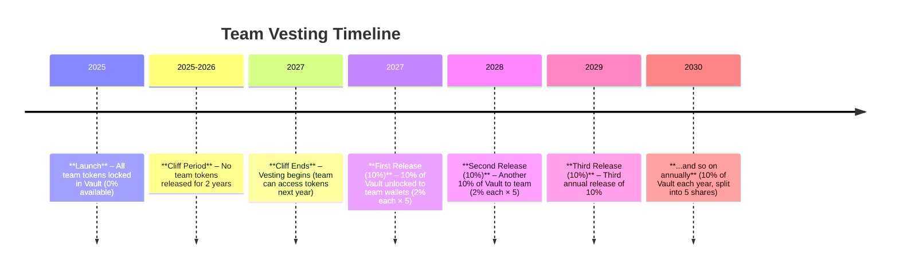

# TOSHIBA Tokenomics and Ecosystem Compendium

## Introduction

TOSHIBA is a next-generation crypto ecosystem launched in 2025, designed with **sustainability, fairness, and trustless decentralization** at its core. This compendium provides a comprehensive overview of TOSHIBA’s tokenomics, dual-token structure, platform modules, and the innovative mechanisms that drive its value. The project emphasizes a **fair launch** (no presale or insider advantage) and renounced contract ownership, ensuring the community can trust the system’s immutability. All components – from automated fee allocations to team vesting – operate via smart contracts with no manual intervention, creating a **self-sustaining ecosystem** that rewards long-term participants.

**What you’ll find in this guide:**

* An explanation of the **dual-token model** (TOSHIBA and TOSHI) and the roles each token plays.
* Details on how various **platform modules** (swap, games, bridge, NFT marketplace, aggregator) generate fees that fuel a **buy-and-lock** mechanism for TOSHIBA.
* A deep dive into the **TOSHIBA Vault** – an immutable smart contract vault that locks away tokens, including its **buy-to-lock logic**, use of **ERC-721/6551 vault NFTs**, **liquidity pool injections**, and other operational hooks.
* The **team vesting structure**, featuring a 2-year cliff and gradual releases via **token-bound wallets** to align the team with the project’s growth.
* An outline of **community incentives** using the TOSHI token, including all giveaways being in TOSHI (not TOSHIBA) to preserve the main token’s supply.
* A special section on the **annual Christmas Day TOSHI airdrop** for loyal (“solid”) TOSHIBA holders.
* Emphasis on how all these elements foster a **sustainable, fair, and decentralized** ecosystem.

The document uses clear language for a non-developer audience while maintaining accurate terminology. Diagrams (with placeholder links) and tables are included to illustrate key concepts, and Mermaid diagrams visualize system flows and timelines.

## Dual-Token Structure: **TOSHIBA** and **TOSHI**

TOSHIBA employs a **dual-token system** consisting of **TOSHIBA** (the primary token) and **TOSHI** (the secondary utility token). Each token serves a distinct purpose in the ecosystem, working together to create a balanced and sustainable tokenomics model:

* **TOSHIBA (Primary Token):** TOSHIBA is the core **value token** of the ecosystem. It has a fixed supply and was launched fairly without presales. This token captures the long-term value of the platform — as the ecosystem’s services are used, TOSHIBA tokens are continuously **bought from the market and locked** in the TOSHIBA Vault (discussed later), creating scarcity and upward pressure on value. TOSHIBA represents **ownership and governance potential** (if community governance is introduced) and is the token that the market trades as the flagship asset of the project. Importantly, TOSHIBA is **deflationary by design**: over time, more of its supply gets locked away, and **no new TOSHIBA is minted** beyond the initial supply.

* **TOSHI (Utility Token):** TOSHI is the ecosystem’s **utility and reward token**. All community rewards, game incentives, airdrops, and giveaways are distributed in TOSHI – never in TOSHIBA – to protect the main token’s supply. TOSHI is used within games and platform features, possibly as an in-platform currency for micro-transactions, fees, or reward points. It can be earned through participation (for example, winning games or as loyalty rewards) and has a more flexible supply. By using TOSHI for incentives, the ecosystem ensures that rewarding users does not dilute TOSHIBA’s value. TOSHI’s supply and distribution are controlled to support platform needs (e.g., a portion might have been set aside for rewards pool or it may be mintable under strict rules), maintaining **controlled inflation** for utility purposes. While TOSHI is tradeable and holds value, it is **intentionally kept separate** from the governance/value accrual of the main system.

**Why a Dual-Token Model?** This structure allows TOSHIBA to serve as a **store of value and governance asset** with strong scarcity dynamics, while TOSHI serves as a **medium of exchange and reward** within the ecosystem. Users get the best of both worlds: a token (TOSHIBA) that appreciates as the platform grows, and a token (TOSHI) they can use and earn without worrying about devaluing the main token. It also prevents confusion and conflicts of interest – for example, the team can generously reward community engagement in TOSHI without flooding the market with TOSHIBA.

Below is a summary comparison of the two tokens:

| **Aspect**         | **TOSHIBA (Main Token)**                                                                                               | **TOSHI (Utility Token)**                                                                                                      |
| ------------------ | ---------------------------------------------------------------------------------------------------------------------- | ------------------------------------------------------------------------------------------------------------------------------ |
| **Role**           | Core value & governance token; reflects platform value.                                                                | Utility and reward token; fuels platform activities.                                                                           |
| **Supply**         | Fixed at launch (deflationary over time as tokens get locked in vault).                                                | Flexible/controlled supply (minted or allocated for incentives as needed).                                                     |
| **Distribution**   | Fair launch (no presale); majority in circulation or locked in vault; team portion vesting over years.                 | Earned via platform use (games, rewards, airdrops); allocated to community incentives.                                         |
| **Usage**          | Held for value appreciation, potential governance rights, and eligibility for special rewards (e.g., holder airdrops). | Used for in-ecosystem spending (game fees, etc.), rewards, giveaways, and possibly fee payment for discounts.                  |
| **Value Dynamics** | Market-driven price; value accrues from buy-and-lock mechanism reducing circulating supply.                            | Stability aimed for utility; value supported by demand for platform features and periodic burns or sinks to prevent inflation. |
| **Inflation**      | None after launch (no new tokens minted; supply only decreases as tokens are locked).                                  | Moderate (issued as needed for rewards, within limits); does not impact TOSHIBA’s fixed supply.                                |
| **Governance**     | Could confer voting rights if governance introduced; symbolizes stake in ecosystem’s success.                          | Not used for governance; purely functional within the ecosystem.                                                               |

By segregating functions this way, TOSHIBA and TOSHI together create a **robust tokenomic synergy**: TOSHIBA captures and locks in the value generated by the ecosystem, while TOSHI powers the day-to-day operations and keeps users engaged.

## Ecosystem Modules and the Buy-to-Lock Mechanism

The TOSHIBA ecosystem comprises several platform modules, each providing useful services to users and simultaneously contributing to the tokenomics via a **buy-to-lock** fee mechanism. Every time a user engages with a module (whether trading, gaming, bridging assets, etc.), a small fee is collected. These fees are not taken as profit; instead, they are utilized to **purchase TOSHIBA tokens from the open market and lock them into the Vault**, strengthening the token’s value. This design means **platform usage directly translates into TOSHIBA demand and scarcity**.

The key modules and how their fees support the ecosystem are outlined below:

| **Ecosystem Module**            | **Fee Mechanism & Contribution to Vault**                                                                                                                                                                                                                                                                                                                                                                |
| ------------------------------- | -------------------------------------------------------------------------------------------------------------------------------------------------------------------------------------------------------------------------------------------------------------------------------------------------------------------------------------------------------------------------------------------------------- |
| **Swap (DEX)**                  | A small swap fee (e.g., 0.3% per trade) is collected whenever users exchange tokens. A portion of this fee is automatically used to market-buy TOSHIBA tokens, which are then sent to the Vault (locked). The result: each trade on TOSHIBA Swap gradually reduces TOSHIBA’s circulating supply.                                                                                                         |
| **Games (Gaming Platform)**     | Entry fees, in-game purchases, or tournament fees in the TOSHIBA Games platform contribute to the Vault. For example, if users pay TOSHI or other tokens to play games or place bets, a percentage of those fees is converted into TOSHIBA and locked away. Higher game activity means more buy-and-lock events, aligning entertainment with ecosystem value.                                            |
| **Bridge** (Cross-Chain Bridge) | The TOSHIBA Bridge allows users to transfer assets between chains, charging a minor bridge fee. Those fees are partially used to acquire TOSHIBA on the main chain and lock it in the Vault. Thus, every cross-chain transfer incidentally supports TOSHIBA’s price by creating buy pressure.                                                                                                            |
| **NFT Platform**                | The NFT module (marketplace or launchpad) charges listing fees or takes a commission on NFT sales. These fees, whether collected in ETH, TOSHI, or other tokens, are programmatically swapped for TOSHIBA and locked. Additionally, if NFTs are minted for TOSHIBA holders, any mint fees could directly require TOSHI (for utility) while still using some portion to boost TOSHIBA value via buybacks. |
| **Aggregator** (DEX Aggregator) | The aggregator finds the best trades across multiple exchanges for users. It may charge a small service fee for each trade routed. That fee is automatically converted into TOSHIBA and locked. Essentially, even when users trade outside the native swap (to get the best price via aggregator), the ecosystem still captures value for TOSHIBA.                                                       |

**How Buy-and-Lock Works:** Each module has **operational hooks** in its smart contracts that funnel a portion of fees to a central buy-and-lock function. For example:

* In the Swap module, whenever a swap occurs, the smart contract takes the fee, swaps it (if it’s in another token like ETH or USDC) for TOSHIBA via a DEX, then sends those TOSHIBA into the Vault contract.
* In the Games module, if a game charges 10 TOSHI to play, perhaps 1 TOSHI of that fee is taken by the system. The system could automatically swap that 1 TOSHI (or its equivalent value from a prize pool) into TOSHIBA on the market and lock it. Alternatively, if games accept TOSHIBA directly for entry, those TOSHIBA might be sent straight to the Vault, effectively removing them from circulation.

Each component thus acts as a **value engine** for TOSHIBA. As user activity grows, more fees flow in, more automatic buybacks happen, and more tokens get locked away. This creates a positive feedback loop:

* Users enjoy useful services (trading, gaming, etc.).
* Their usage generates fees.
* Fees are converted into **locked value** for the ecosystem’s main token.
* This potentially increases TOSHIBA’s scarcity and market value, rewarding holders.
* A higher token value further incentivizes holding and participation, bringing more users.

To visualize, consider the flow of value in the ecosystem:

```mermaid
flowchart LR
    %% Fee sources
    subgraph FeeSources["Fee Sources"]
        SwapTrades["Swap Trades<br/>0.15 % fee"]
        GamePlays["Game Plays<br/>30 % profit"]
        BridgeTx["Bridge Transfers<br/>0.4 % fee"]
        NFTSales["NFT Sales<br/>10 % fee"]
        AggTrades["Aggregator Swaps<br/>0.5 % fee"]
    end

    %% Core router & vault
    FeeRouter["Fee Router<br/>(auto buy & lock)"]
    Vault["TOSHIBA Vault<br/>(locked tokens)"]

    %% Vault outputs
    LPAdd["Adds LP<br/>TOSHIBA-ETH"]
    TeamVest["Team Wallets<br/>(2 % × 5 per yr)"]
    ToshiPool["TOSHI Rewards Pool"]

    %% Reward sinks
    SingleStake["Single Staking<br/>(earn TOSHI)"]
    LPFarm["LP Farming<br/>(earn TOSHI)"]
    XmasDrop["Christmas Airdrop<br/>(solid holders)"]

    %% Flows from fees → router
    SwapTrades -->|fees| FeeRouter
    GamePlays  -->|fees| FeeRouter
    BridgeTx   -->|fees| FeeRouter
    NFTSales   -->|fees| FeeRouter
    AggTrades  -->|fees| FeeRouter

    %% Router → Vault
    FeeRouter -->|buys TOSHIBA → locks| Vault

    %% Vault branches
    Vault -->|pairs with ETH| LPAdd
    Vault -->|yields TOSHI|  ToshiPool
    Vault -. "2-yr cliff → 10 %/yr" .-> TeamVest

    %% TOSHI flow
    ToshiPool --> SingleStake
    ToshiPool --> LPFarm
    ToshiPool --> XmasDrop


```

*(Diagram: The flow of fees from various modules into the Vault. User actions in modules generate fees, fees are used to buy TOSHIBA from the market, and those tokens go into the Vault. The Vault’s growing holdings benefit all holders by reducing circulating supply; the team’s vested share and community airdrops are drawn from the Vault under strict conditions.)*

In summary, **every part of the TOSHIBA platform contributes to a unified tokenomic goal: continuously locking value into TOSHIBA.** This not only supports the token price but also showcases a revenue model where the “profit” is essentially returned to the community (as value accrual) rather than extracted.

## The TOSHIBA Vault: Locking Value Permanently

At the heart of TOSHIBA’s tokenomics is the **TOSHIBA Vault** – an immutable smart contract vault designed to **lock away TOSHIBA tokens forever** (except for the small portions released in a controlled manner for team vesting). The Vault is a cornerstone of trustless decentralization and fairness in the ecosystem.


**Key characteristics of the TOSHIBA Vault:**

* **Immutable and Autonomous:** The Vault’s code is **immutable** – once deployed, its rules cannot be changed (the ownership of the Vault contract is renounced or nullified). No one (not even the developers) can withdraw tokens arbitrarily or alter the Vault’s logic. This provides strong assurances to the community that tokens sent to the Vault are truly locked by code, not subject to human whims. The Vault only allows withdrawals as explicitly coded (such as the team’s vesting schedule or specific automated events like the Christmas airdrop snapshot, if those are part of the logic).

* **Buy-to-Lock Logic:** The Vault contract likely exposes a function that the various modules call with the amount of TOSHIBA to lock. When triggered by ecosystem fees (as described earlier), the Vault receives TOSHIBA tokens and holds them indefinitely. Typically, these tokens are sent to the Vault address and **cannot be transferred out** except via predefined mechanisms. Over time, the Vault accumulates an increasing balance of TOSHIBA, effectively **taking those tokens out of circulation**. This locked balance serves as a public indicator of how much value the ecosystem has captured and can be monitored on-chain by anyone.

* **Vault as an NFT (ERC-721) with Token-Bound Account (ERC-6551):** The Vault is not just a passive repository; it’s an innovative construct possibly represented by an **ERC-721 NFT** that has its own smart contract wallet (enabled by **ERC-6551**, the token-bound accounts standard). In simpler terms, the Vault itself can be thought of as a special NFT that holds assets (in this case, a large amount of TOSHIBA tokens). The use of ERC-6551 means this NFT Vault has an Ethereum address/account of its own where it stores the tokens. This design allows for interesting possibilities:

  * The Vault’s NFT could enable **transparent accounting** (the NFT’s account holds all locked tokens and possibly other assets like liquidity tokens).
  * Because the Vault is an NFT, certain interactions (like transferring ownership of the Vault contract, if ever needed, or linking it with other NFTs) can be managed in a standard way, though in this case the Vault NFT is likely locked/owned by the system itself.
  * **Token-bound accounts (ERC-6551)** allow the Vault to interact with other smart contracts if needed, following predefined rules. For instance, the Vault’s account might be programmed to automatically participate in governance (if TOSHIBA has governance features, the Vault’s holdings might vote neutrally or not at all), or to execute the scheduled team releases each year by transferring tokens to team wallets.

* **Native Token LP Injection:** In addition to holding TOSHIBA tokens, the Vault also contributes to **liquidity pool (LP) injections** for TOSHIBA’s trading pairs. A portion of the fees collected by modules might be used not only to buy TOSHIBA, but also to ensure there’s ample liquidity for trading. For example, the system could use some fees to acquire equal values of TOSHIBA and a base currency (like ETH or a stablecoin) and add them to a liquidity pool on a DEX. The LP tokens received could then be sent to the Vault’s ownership. By doing this:

  * The **trading liquidity for TOSHIBA** deepens over time, reducing volatility and slippage for traders.
  * Those LP tokens are effectively locked as well (since the Vault holds them and does not withdraw them), meaning liquidity remains in place, further protecting against any potential rug-pull scenario.
  * This provides stability and confidence for investors, knowing that significant liquidity is locked and growing, paralleling the locked token supply.
  * *Note:* The exact proportion of fees going to direct TOSHIBA buy-and-lock vs. LP injection can be tuned. For instance, the system might allocate 80% of fees to buy-and-lock and 20% to LP injection, to balance value accrual with liquidity growth.

* **Operational Hooks and Automation:** The Vault interacts with other parts of the ecosystem through automated “hooks.” For example, when the swap module triggers a buy-and-lock, it calls the Vault’s interface to deposit the tokens. Similarly, the Vault might have a scheduled function (or be paired with a time-lock contract) for releasing team tokens annually, and for initiating the yearly snapshot for the Christmas airdrop. These operations happen according to code:

  * **Team Vesting Hook:** Once the 2-year cliff passes, the Vault (or a connected vesting contract) may automatically calculate 10% of its balance and distribute it to the team’s token-bound wallets (detailed in the next section). This could happen in a single annual transaction triggered by a team member or a governance call that is permissioned to execute only at the correct time.
  * **Airdrop Snapshot Hook:** On a set date (e.g., December 25th each year), the Vault or a related controller contract might take a **snapshot** of all TOSHIBA holders to determine “solid holders” for the TOSHI airdrop. The Vault could then escrow the TOSHI rewards (from a reserve or by signaling how much to mint/distribute) based on that snapshot. The actual distribution might be handled by a separate airdrop contract, but the Vault could be the authority that signs off on it, ensuring only holders at snapshot benefit.
  * **Fee Conversion Automation:** The Vault’s interface can only accept TOSHIBA, so any fees in other tokens are converted by the module contracts before sending in. This decouples the conversion logic from the Vault – the Vault simply receives and locks TOSHIBA. Such separation of concerns makes the system modular and easier to audit.

In essence, the TOSHIBA Vault acts as a **black hole for tokens** – once TOSHIBA goes in, it *rarely* comes out. The only exceptions are the programmed, **community-endorsed releases** (like team vesting and holder rewards) which are done at a modest pace. This ensures the vast majority of TOSHIBA locked in the Vault stays there, continually shrinking effective circulating supply.

## Team Vesting and Token-Bound Wallets

TOSHIBA’s commitment to fairness extends to how the **team’s tokens** are handled. Rather than allocating a large chunk of tokens to the team upfront to be potentially sold at will, TOSHIBA implements a **strict vesting schedule** that aligns the team’s incentives with the long-term health of the project. All team tokens are locked in the TOSHIBA Vault from day one, and their release follows a 2-year cliff and gradual distribution thereafter.

**Team Vesting Structure:**

* **2-Year Cliff:** For the first two years after launch (i.e., 2025 through 2026 if launch is in early 2025), the team cannot access any of their allocated tokens. This **cliff period** means the team must deliver and grow the platform without any token compensation, demonstrating commitment. It assures the community that no team member can dump tokens during the crucial early phase. Only after the cliff expires (around the beginning of 2027) does the vesting begin.

* **Gradual Annual Releases (10% per year):** After the 2-year cliff, the team’s tokens unlock at a rate of **10% of the Vault’s balance per year**. This is a percentage of whatever the Vault holds at that time, not just a fixed number of tokens. Therefore, if the platform has performed well and the Vault has grown, the team’s reward that year will be larger (in absolute tokens), whereas if growth was slower, the team also gets less. This dynamic ties the team’s rewards to ecosystem success. The release happens annually, creating a predictable schedule (rather than continuous trickle, which might be hard to track). Each year’s 10% is the total amount that can leave the Vault for the team.

* **Split into 5× 2% Allocations:** The 10% yearly release is divided equally among **5 token-bound wallets**, each receiving 2% of the Vault’s balance. This implies there are likely 5 main team members or stakeholder entities, each with their own allocation. By splitting it, no single entity controls the entire released amount, and it enforces equality or predefined shares among the team. Each of these 5 allocations is managed via a **token-bound wallet** – which likely refers to an ERC-6551 based NFT wallet. Essentially, each team member might hold an NFT that is bound to a smart contract account. When vesting occurs, the Vault transfers 2% of its tokens to each of these NFT-controlled accounts. This method has a few advantages:

  * The team wallets themselves are **transparent** and can be monitored on-chain via their NFT or account addresses.
  * The use of token-bound accounts for team wallets might restrict how they can handle the tokens (for example, it could enforce that they cannot sell all at once by further timelocking tokens inside those wallets, or by requiring multi-sig approvals – features that could be built into the wallet’s smart contract logic).
  * It’s an innovative use of ERC-6551 that showcases how NFTs can represent roles or allocations within a project.

* **Ongoing Vesting, Long-Term Commitment:** At 10% per year, the vesting is **stretched over many years**. The team will never receive 100% of the vault (because as they withdraw 10%, the next year it’s 10% of a slightly smaller amount if no new tokens were added, or of a larger amount if the vault grew). In fact, if no new tokens entered the vault after the cliff, the amounts form a diminishing sequence (10%, then 10% of 90%, etc.). However, since the vault continues to grow from platform fees, the team’s 10% each year could even increase in absolute terms. This mechanism strongly **aligns the team’s incentives with continuous development** – to maximize their yearly 2% shares, they need the vault to be as large as possible, which only happens if the ecosystem is thriving. It disincentivizes short-term actions and quick profit-taking.

The timeline below illustrates the vesting schedule for the team:



*(Diagram: Team vesting timeline from launch in 2025 through the cliff and subsequent annual releases. Each release is 10% of the then-current vault holdings, distributed evenly to 5 token-bound team wallets.)*

**Transparency and Trust:** Because the vesting is handled by smart contracts, the community can verify the schedule and amounts on-chain. There’s no scenario where the team can speed up their vesting or get more than allowed – the code enforces the limits. Additionally, if a team member leaves, their token-bound NFT wallet can be held or reassigned without altering the underlying vesting amount, maintaining continuity.

In summary, the team vesting approach is highly **sustainable and trust-building**:

* It reassures investors that the team is in it for the long haul.
* It prevents the market from being flooded with team tokens at any point.
* It uses cutting-edge token-bound account tech to manage the allocations transparently.
* It ensures the team focuses on growing the platform (which grows the Vault), aligning with community interests.

## Community Incentives and TOSHI Rewards

While TOSHIBA tokens are systematically locked to drive value, the ecosystem also fosters an active community through **incentives and rewards** — all powered by the **TOSHI utility token**. By using TOSHI (and not TOSHIBA) for rewards, the project maintains TOSHIBA’s scarcity and value, while still rewarding participation.

**Key points about community rewards:**

* **All Giveaways in TOSHI:** Any community giveaway, contest reward, marketing airdrop, or incentive (such as referral bonuses, participation rewards in events, etc.) is distributed in TOSHI tokens. For example, if there’s a trading competition or a bug bounty, winners would receive TOSHI. This avoids putting downward pressure on TOSHIBA, since giving out TOSHIBA that’s been locked or circulating could encourage dumping. TOSHI, being the utility token, can be more freely given without harming the core tokenomics of the project.

* **Game Rewards and Participation Incentives:** The TOSHIBA Games module likely uses TOSHI as the reward currency. If players win a tournament or achieve milestones, they might earn TOSHI. This gives TOSHI a clear utility — it’s the **play-to-earn reward** and can be spent back in games or exchanged if the user desires. Similarly, if there are quests or missions in the ecosystem (like educational tasks, or providing liquidity to the DEX, etc.), the rewards would be in TOSHI.

* **Liquidity Mining or Yield Farming:** Should the project incentivize liquidity providers or other DeFi participants, those rewards would also be in TOSHI. For instance, adding liquidity to the TOSHIBA/TOSHI trading pair might earn you TOSHI rewards over time. This again keeps the main token’s supply intact while still providing attractive yields to participants.

* **Governance and Voting Incentives:** If the ecosystem has off-chain governance events or community votes (since TOSHIBA’s ownership is renounced, formal governance might be limited, but community-driven proposals could exist), participants might be thanked with TOSHI for their involvement or for performing community service (like moderating forums, etc.).

* **No TOSHIBA Emissions:** It is explicitly clarified that **no TOSHIBA tokens are ever given out as rewards**. Apart from the team vesting, the only “distribution” of TOSHIBA is via open-market purchases (from fees) that go straight to the Vault. This means the circulating supply of TOSHIBA only decreases or stays the same over time, never increasing from incentives. TOSHIBA can only be obtained by buying it on the market (or perhaps initial fair distribution), which is a strong bullish constraint on supply.

* **TOSHI Supply Management:** Although TOSHI is used freely for rewards, the project maintains careful control to avoid hyperinflation of TOSHI. There may be a large but fixed allocation of TOSHI set aside for these purposes, or a minting schedule that is modest. Additionally, the ecosystem could implement **burning mechanisms for TOSHI** (for example, using some fees or a portion of unclaimed rewards to buy back and burn TOSHI) to keep its value relatively stable. The goal is to have TOSHI remain valuable enough that rewards are meaningful, but not so value-accruing that it overshadows TOSHIBA’s role.

* **Utility of TOSHI:** Beyond just being “reward points,” TOSHI likely has multiple uses in the ecosystem:

  * It might be required for certain fees or discounted access (e.g., paying fees in TOSHI might grant a discount on the swap or bridge).
  * It could possibly be staked for perks or to earn more TOSHI (though if so, any staking yield should come from real platform revenue to be sustainable).
  * In the NFT platform, maybe some NFT sales or mints only accept TOSHI, giving it a sink.
  * These uses encourage people who earn TOSHI to hold or rebuy in, creating a mini-economy around TOSHI, separate from but complementary to TOSHIBA.

By clearly delineating that **community and promotional activities use TOSHI**, TOSHIBA ensures the main token’s integrity. This two-token approach is somewhat analogous to many gaming or DeFi projects where one token is for governance/value and the other is for utility/rewards (avoiding “farm and dump” issues on the main token).

The community benefits by receiving tokens they can actually use within the ecosystem, and if they believe in the project, they may even trade some TOSHI for TOSHIBA to invest in the core token – but that’s a market choice rather than something forced by the project.

## Annual Christmas Day Airdrop for Solid Holders

One of the most unique and community-centric features of the TOSHIBA ecosystem is the **annual Christmas Day TOSHI airdrop** to reward “solid holders” of TOSHIBA. This tradition underlines the project’s appreciation for loyal supporters and adds a bit of festivity and anticipation to the yearly cycle.

**What is the Christmas Day Airdrop?** Every year on **December 25th (Christmas Day)**, the project distributes a special airdrop of TOSHI tokens to addresses that have shown strong loyalty in holding TOSHIBA. The distribution is based on a **snapshot weighting**, ensuring fairness and proportional rewards.

* **“Solid Holders” Definition:** Solid holders generally refer to those who hold a significant amount of TOSHIBA and keep it through ups and downs (demonstrating faith in the project). The exact criteria might include:

  * A snapshot of TOSHIBA holdings taken on a specific date (or over a period) close to the airdrop. Typically, a snapshot might be taken on Christmas Eve or at a preset block on Christmas Day.
  * Only wallets that have held TOSHIBA continuously or above a certain minimum amount qualify. For example, there could be a requirement like a wallet must hold at least X TOSHIBA by the snapshot to be eligible, to avoid dust accounts.
  * The project may also factor in how long the tokens were held (e.g., excluding those who bought a large amount right before the snapshot just to game the airdrop). However, implementing time-based weighting on-chain is complex, so it’s likely a simpler snapshot of balances at a point in time, assuming most loyal holders will naturally have their funds in place.

* **Snapshot Weighting:** The airdrop is proportional to the amount of TOSHIBA each eligible holder has at the snapshot. In practice, if Alice holds 1% of all eligible TOSHIBA at the snapshot, she would receive 1% of the TOSHI allocated for the airdrop. This **pro-rata distribution** ensures fairness – bigger stakeholders get larger rewards, but everyone gets the same treatment relative to their investment. It avoids any manual selection or favoritism; it’s purely by the numbers.

* **Airdrop Source and Amount:** The pool of TOSHI for the airdrop likely comes from ecosystem reserves or possibly from the Vault logic (though the Vault itself holds TOSHIBA, not TOSHI, so more likely a separate community reserve contract or a controlled mint is used). The amount might be a fixed number of TOSHI each year or could be determined by some formula (e.g., a percentage of total TOSHI supply or a portion of platform fees converted to TOSHI). For transparency, the project would announce the total pool and the snapshot time ahead of Christmas.

* **Distribution Mechanism:** After the snapshot, the distribution of TOSHI could be automatic. A contract could read the snapshot data and disburse TOSHI accordingly to each address. Alternatively, a claim portal might be used where eligible users can claim their share of the airdrop by connecting their wallet (the contract would have recorded their entitlement). The distribution is done on Christmas Day, making it a “gift” to the loyal community.

* **Encouraging Holding Behavior:** This annual airdrop creates a gamified incentive to **hold TOSHIBA year-round**, or at least towards the end of the year. Knowing that a snapshot will determine free rewards, holders are less inclined to sell before the holidays. In fact, it might even create an effect where people buy more TOSHIBA as the snapshot approaches, to get a bigger share of the airdrop, which can positively impact the market price (though the project must manage timing communication to avoid too much speculative pumping). The ethos is to reward those who truly believe in the project long-term.

* **Community Spirit:** Beyond the financial aspect, the Christmas airdrop fosters a sense of community and tradition. It’s something users will look forward to each year, discuss in community channels, and celebrate together. Such traditions can strengthen the emotional bond between users and the project, which is valuable in the crypto space.

In summary, the **Christmas Day TOSHI Airdrop** is both a token of gratitude and a clever tokenomic incentive:

* It thanks loyal TOSHIBA holders with a useful reward (TOSHI tokens they can use or trade).
* It reinforces the dual-token model by giving out TOSHI (not TOSHIBA) and thereby not increasing circulating TOSHIBA.
* It encourages behavior (holding) that stabilizes the token’s investor base.
* It adds an element of joy and festivity, aligning the project’s culture with a season of giving.

## Sustainability and Decentralized Trust

TOSHIBA’s entire design revolves around sustainable growth and trustless operation. From the fair launch to the renounced ownership and immutable contracts, every decision was made to ensure the project can thrive without relying on a centralized authority or unsustainable practices.

**Fair Launch:** TOSHIBA was launched without any presale or “insider” token distribution. This means no private investor or team member got an unfair amount of tokens at a discount before the public had a chance. Typically, a fair launch might involve the team creating initial liquidity in a DEX with a modest amount of tokens, or distributing tokens via an airdrop or community mining event, such that everyone has equal opportunity. The result is a wide distribution of TOSHIBA tokens from the start, preventing centralization of supply. Fair launch sets the tone for a community-driven project, and it ensures that the **market freely discovered the token’s price** based on supply and demand.

**Renounced Ownership:** The smart contracts (especially the TOSHIBA token contract and possibly the Vault contract) have **renounced ownership**. In practical terms, this means the deployers have **relinquished any privileged control** over contract functions. Commonly, token contracts have an owner role that could mint new tokens, adjust fees, or halt trading. By renouncing, the TOSHIBA team locked in the token’s code as-is, forever. No one can mint new TOSHIBA, no one can arbitrarily change fees or do a rug pull function. This is a strong commitment to decentralization – essentially **the code is law**, and even the creators cannot break the rules later. For users, this provides peace of mind that the token is **trustless**; the only way it changes is through normal on-chain governance (if a separate governance contract was to be used) or not at all.

**Locked Liquidity:** While not explicitly stated above, a typical fair launch/decentralized project will also **lock liquidity pool (LP) tokens** for a long duration (or send them to a burn address or the Vault). It’s worth noting that if any initial liquidity was provided by the team, those LP tokens are likely locked or burned, meaning the team can’t pull out the base currency and leave users holding an illiquid token. In TOSHIBA’s case, since the Vault can hold LP tokens from the fee injection mechanism, the Vault itself serves as a form of permanent liquidity lock. Anyone can verify on-chain the portion of liquidity owned by the Vault (or burned) which assures **continuous market availability** for trading.

**Sustainable Economics:** Unlike some projects that rely on constant inflation, high-yield emissions, or Ponzi-like dynamics to attract users, TOSHIBA’s model is grounded in **real value creation**:

* The **buy-and-lock** mechanism ties token value to actual usage of services. The more people use the platform, the more value flows into the token. This is akin to a dividend or buyback in traditional finance – except instead of distributing value to holders directly, it’s increasing the value of the token by reducing supply.
* Using a **secondary token (TOSHI)** for rewards means the project can incentivize activity without damaging the value of the primary asset. Many projects fail because they give away their main token as rewards, causing sell pressure that depresses the price; TOSHIBA avoids this trap.
* The team’s slow vesting means there is **no sudden increase in circulating supply** at any point. Many projects see a price crash when large cliffs or unlocks happen; here, the team’s unlock of 10% per year is gradual and predictable. Plus, because it’s percentage-based, if the project does extremely well, the actual number of tokens 10% represents will be higher, but the market likely can absorb it due to increased demand and volume by that point. If the project underperforms, the team automatically gets fewer tokens, which is fair.
* **No extraneous taxes or costs:** Aside from the platform usage fees (which go back to the ecosystem via the vault), there likely are no transaction taxes on the token itself. TOSHIBA can be traded freely without, say, a 5% burn or fee on each transfer – often such token taxes are a sign of unsustainable design. Instead, TOSHIBA’s value accrual is via platform fees, which is more organic.

**Trustless and Decentralized:** Every element of the ecosystem that can be automated is automated:

* The Vault operations, team vesting, and airdrops all run on predefined smart contract logic. Users do not have to “trust” that the team will do something; they can trust the code because it’s public and audited (the project would presumably have audits given the complexity).
* There is no single point of failure or control. Even the team, while important for building the platform, does not have the power to change the fundamental rules or siphon funds. This decentralization extends to how the project could evolve – with ownership renounced, any changes or new features would likely come in the form of new modules or community-agreed improvements rather than altering core contracts.
* **Community Governance Potential:** If down the line governance is needed (for instance, to decide how to allocate TOSHI incentives or adjust fee percentages), it would probably be done by TOSHIBA holders voting through snapshots or a governance module. While not described in detail here, the groundwork of fair launch and wide distribution makes community governance viable, since no small group has absolute majority.

**Security and Audits:** (While not explicitly requested, it’s worth noting in a compendium.) The complex interplay of modules, vault, and token-bound wallets means the project likely underwent security audits. Immutability is only good if the code is solid. So, the project’s commitment to security is part of sustainability – one cannot change a bug if ownership is renounced, so they must have gotten it right from the start. This is an important point to reassure readers that the trustlessness is backed by rigorous testing and audits.

**Environmental and Economic Sustainability:** Beyond on-chain mechanics, TOSHIBA’s model is about long-term thinking:

* There’s no aim for “get rich quick” APYs that collapse; value comes from real usage.
* The ecosystem encourages **participation** (use the dApps, play the games, hold tokens) rather than speculation alone. This can lead to a more stable community and token demand.
* The annual airdrop tradition and continuous engagement through games/NFTs helps keep the community active year-round, not just at launch.

## Conclusion

The **TOSHIBA Tokenomics and Ecosystem** bring together a rich array of features into a cohesive, sustainable design. By combining a dual-token model with an innovative vault system and aligning both user and team incentives with the platform’s success, TOSHIBA sets a new standard for fair and community-driven crypto projects. Key takeaways include:

* **Value Accrual:** Real utility and activity (trading, gaming, bridging) directly funnel value to TOSHIBA token holders via the buy-and-lock mechanism, instead of value being siphoned off as profit.
* **Protection of Value:** The TOSHIBA Vault and careful token distribution (no inflation, no surprise unlocks) protect the token’s value, making holding TOSHIBA attractive.
* **Engaged Community:** The use of TOSHI for rewards and the annual Christmas airdrop ensure that users are continually engaged and appreciated without jeopardizing the core token.
* **Decentralization:** Fair launch, renounced contracts, and trustless automation mean the project operates transparently and reliably, giving users confidence in the long run.

Together, these elements form a robust tokenomic ecosystem that is **self-reinforcing**: success breeds more success. As the project grows, the Vault grows, the token becomes scarcer, and all participants – community and team alike – benefit from the increased value. Meanwhile, users enjoy a rich platform of services and fun incentives, making TOSHIBA not just an investment, but a vibrant community experience.

*TOSHIBA’s approach exemplifies how thoughtful tokenomics can create a win-win environment for all stakeholders. With everything locked in place – from tokens in the Vault to the smart contracts on the blockchain – the path forward is one of collaborative growth, innovation, and shared prosperity.*
